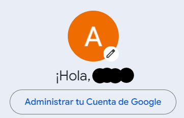
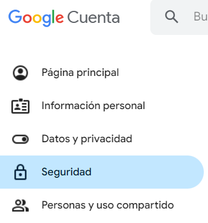
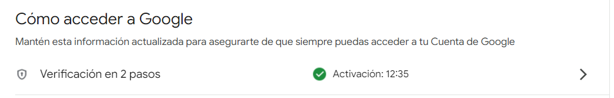
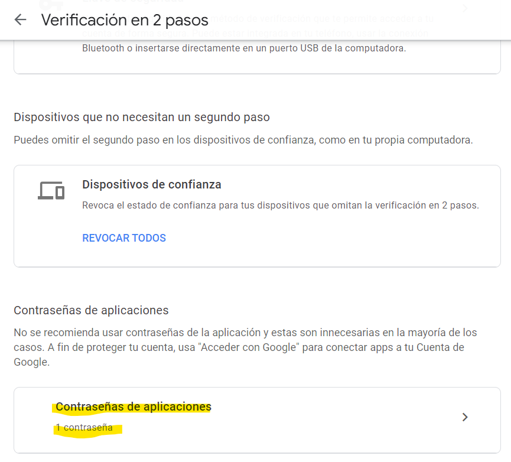
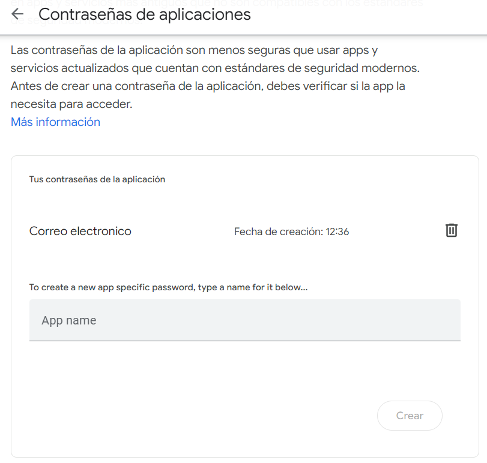

# EmailSendingAutomation
GitHub repository focused on simplifying email sending automation using Python.

-------------------------------------------------------------------------------------------------------------------------------------------------------------------------------------------------------

Pasos para estraer la contraseña de nuestro mail:

1. Ingresar al administrador de nuestra cuenta de google

2. Ingresar al apartado de seguridad

3. Ir al apartado de la verificacion en 2 pasos

4. Ir al apartado de Contraseñas de aplicaciones

5. Crear la contraseña de nuestra aplicacion

